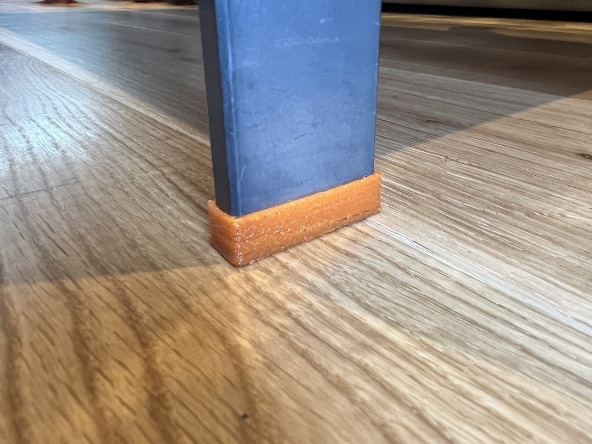
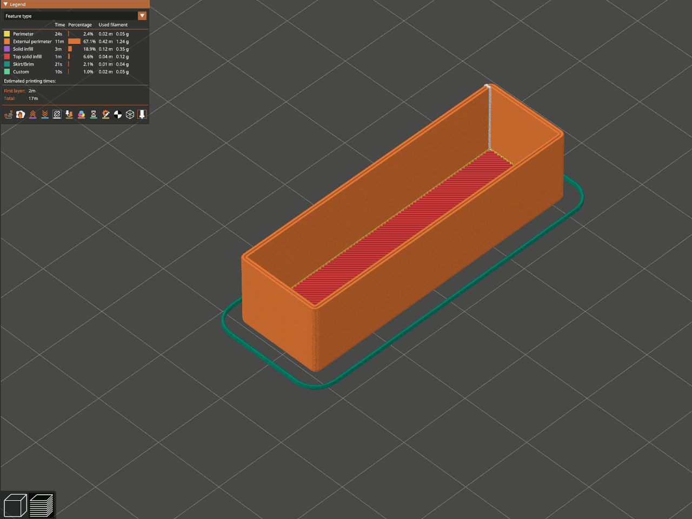

# IKEA Eksjö table foot/sock

I have an IKEA Eksjö table, which has metal legs. I have a wooden floor, which might scratch. This is a foot or sock to prevent scratches when the table moves.

The model is designed to print easily without supports. Be sure to use a flexible filament such as thermoplastic polyurethane (TPU). It's carefully designed to be printed with a 0.4 mm (or 0.6 mm) nozzle and a 0.2 mm layer height. PrusaSlicer slices the walls into a sturdy two-line wall:

Download this delightful design today and add stylish protective socks to your table!

<https://www.printables.com/model/512131-ikea-eksjo-table-footsock>

## License

CC0

## Author

Leon Brocard <acme@astray.com>
